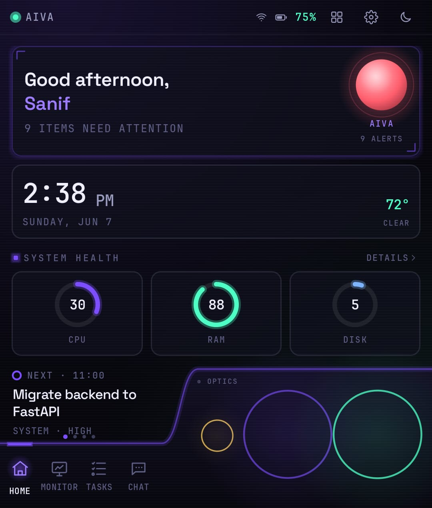
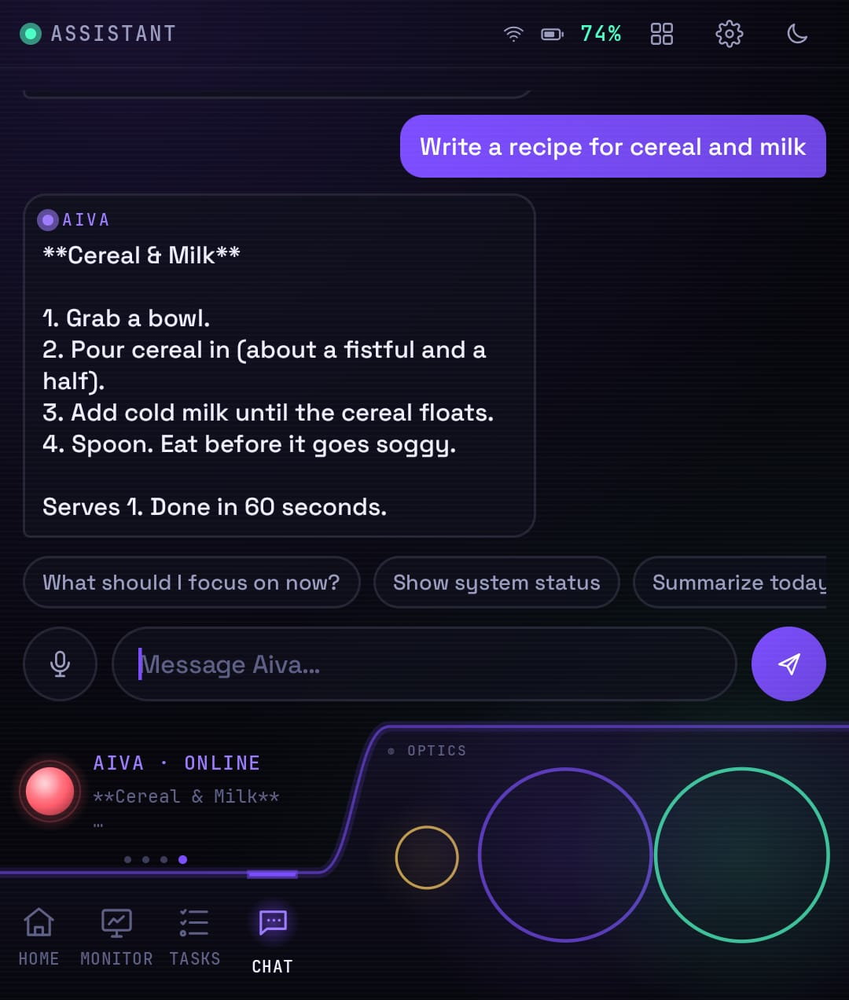
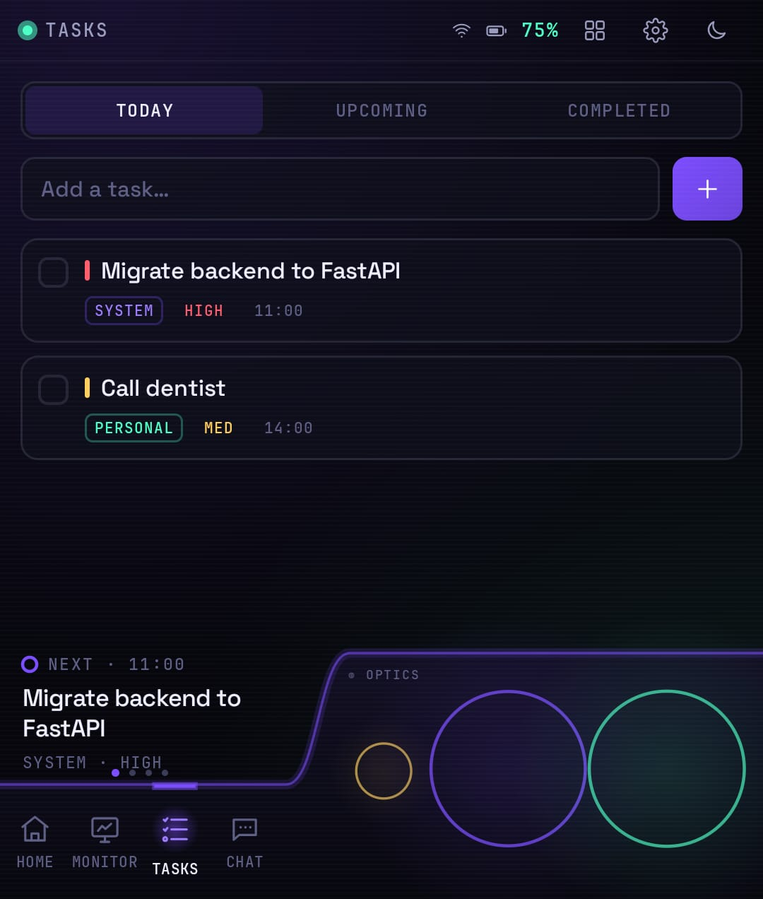
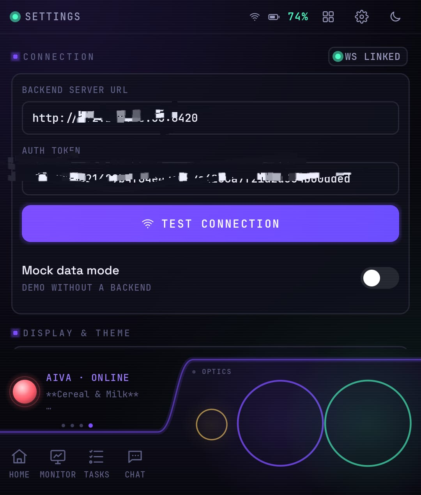

# Aiva

A personal assistant console for the Motorola Razr 60 Ultra cover display.
A FastAPI backend serves system stats, a task tracker, notes and an agent
with tools, memory and a scheduler.

<p align="center">
  
</p>

## Features

- System monitor: CPU, RAM, disk, temperature, network, service health,
  Docker containers, alerts
- Agent chat with 15 tools (status, tasks, notes, actions, scheduling,
  memory), streamed replies, voice input, in-app approval for any action
  the model proposes
- Works with any model: Ollama, OpenRouter, OpenAI via LiteLLM, or bridge
  chat to a local Claude Code / Codex session over MCP
- Self-learning memory: chats auto-stored as episodes, relevance-ranked
  recall, behavioral scores trained by your approve/dismiss taps
  (design credit: [ruflo](https://github.com/ruvnet/ruflo))
- Scheduler: "every morning at 8, summarize my day" creates a job the agent
  runs on time
- Task tracker with projects, tags, subtasks and quick-add syntax
  (`title #project @tag !high`)
- Six always-on ambient clocks drawn around the physical camera lenses,
  one redraw per minute, burn-in drift
- Lens calibration: drag three circles over the cameras once and the whole
  UI positions itself from that
- Web dashboard at `/` with the same data and chat
- Demo mode: the full app works with no backend

| Chat | Tasks | Settings |
|---|---|---|
|  |  |  |

## Quick start

Backend (Python 3.11+):

```bash
cd backend
python3 -m venv .venv && source .venv/bin/activate
pip install -r requirements.txt
cp .env.example .env                 # set API_TOKEN (openssl rand -hex 24)
./run.sh                             # http://0.0.0.0:8420, docs at /docs
```

App:

```bash
cd android
./gradlew :app:assembleDebug
adb install app/build/outputs/apk/debug/app-debug.apk
```

Connect: on the phone, Settings > Backend server URL
(`http://<server-ip>:8420`), paste
your API token, tap Test connection. Demo mode turns itself off on success.
Then run Settings > Lens calibration once.

Away from home, use [Tailscale](https://tailscale.com) on both devices and
the server's tailnet address as the URL. Do not expose the port to the
internet.

## Configuration

Everything lives in `backend/.env`. The interesting ones:

| Key | Purpose |
|---|---|
| `API_TOKEN` | shared secret for the app, dashboard and WebSockets |
| `CHAT_PROVIDER` | `litellm` (any model) or `cli` (local agent session) |
| `LLM_MODEL` | e.g. `ollama/llama3.1`, `openrouter/anthropic/claude-sonnet-4-6` |
| `CHAT_CLI_CMD` | command template for the cli provider, MCP recipe included |
| `MOCK_MODE` | canned data, no LLM needed |

Provider recipes, the full API reference and MCP setup: `backend/README.md`.

User data lives in `workspace/`, created on first run and never tracked. The
markdown files there shape the agent directly, so edit them to make Aiva
yours: `SOUL.md` is her personality and rules, `USER.md` is who you are and
what you care about, and `memory/MEMORY.md` holds long-term facts (she also
appends to these herself through her memory tools). Changes apply on the
next message, no restart needed.

## Security

Token auth on everything except the health check. Actions are allowlisted in
`actions.yaml`; neither the phone nor the model can execute arbitrary
commands. Built for a private network.

## Tests

```bash
cd backend && pip install -r requirements-dev.txt && python -m pytest   # 53
cd android && ./gradlew :app:testDebugUnitTest                          # 20
```

## License

MIT. Memory design credit: [ruflo](https://github.com/ruvnet/ruflo) by
@ruvnet.
